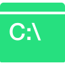

<h1 align="center">Hi, I'm Anish! </h1>

<h3 align="center">I'm a Software Engineer aspirant and Web Developer from India ♥</h3>

I am Anish, a Junior Developer, currently learning web development and trying to build some cool projects. I am an Open Source enthausiast and currently trying to understand this community more. Always ready to collaborate on exiting and innovating ideas and projects. You can also find playing with embedded systems in my free time. Techie girls attracts me most.

<!--   not workng yet -->

## Know more about me! 👦
  

  
 
  

  

  
- 🔭 I’m currently learning <code>Data Structures</code>,<code>Algorithms</code>, <code>Web Devlopment</code>
- 🌱 I’m currently working on <code>Web Dev Projects</code>
- 👯 I’m looking to collaborate on <code> Full-Stack web projects </code>, <code> Community encouragement progrmas </code>
- 🤔 I’m looking for help with <code>Data Structures</code>, <code>Algorithms</code> and <code>Web Dev stuff</code>
- 💬 Ask me about <code>C++</code>, <code>HTML</code>, <code>CSS</code>, <code>DSA</code> and <code>Myself</code>
- 📫 How to reach me: <code><a href="https://www.linkedin.com/in/kmranish04/">LinkedIn</a></code>
- 😄 Pronouns: <code>He/His/Him</code>
- ⚡ Fun fact: <code>I love infinite loops ♻</code>	

  

  

<!--   -->

<!-- 
 -->
  

## Tech Stack! 👨‍💻

<!-- <h3 align="center">Tech Stack! 🧱🛠</h3> -->

 
  

 

  
 

 

## Github Status 🏆
<!-- <h3 align="left">Statistics! 📊</h3> -->
 

 

    

 

## Connect With me! 🔗🙋‍♂️

 

<h2 align="center">Show some ❣</h2>

### Show some ❤️ by starring ⭐ some of the repositories!
