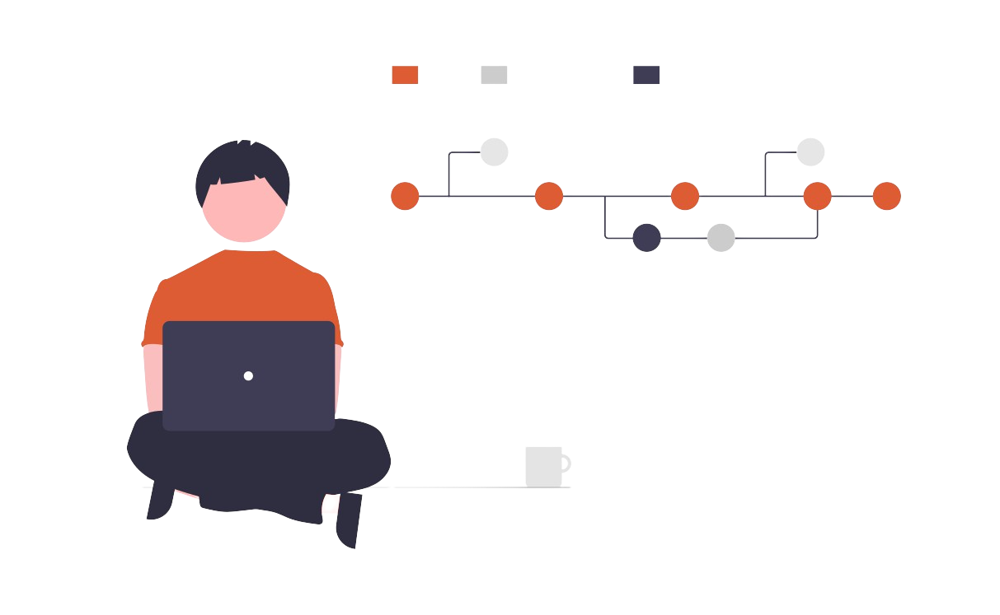

<!--  -->

<h1 align="center">Hi, I'm Anish! </h1>

<h3 align="center">I'm a Software Engineer aspirant and Web Developer from India ♥</h3>

I am Anish, a Junior Developer, currently learning web development and trying to build some cool projects. I am an Open Source enthausiast and currently trying to understand this community more. Always ready to collaborate on exiting and innovating ideas and projects. You can also find playing with embedded systems in my free time. Techie girls attracts me most.

<!--   not workng yet -->

## About me! 👦

<!-- <h3 align="center">About me! 👦</h3> -->
 

- 🔭 I’m currently learning **Web Development, Data Structures and Algorithms**
- 🌱 I’m currently working on **Web Development**
- 👯 I’m looking to collaborate on **Full Stack Web projects**
- 🤔 I’m looking for help with **Application and web development**
- 💬 Ask me about **Data Structures, Algorithms and Web Dev stuff**
- 📫 How to reach me: **anish.1903.kmr@gmail.com**
- 😄 Pronouns: He/His/Him
- ⚡ Fun fact: **I love infinite loops**

## 👨‍💻 Tech Stack!

<!-- <h3 align="center">Tech Stack! 🧱🛠</h3> -->
 

  

 

 

 

## 🏆 Github Status
<!-- <h3 align="left">Statistics! 📊</h3> -->
 

 

    

 

## Connect With me! 🔗🙋‍♂️

 

<h2 align="center">Show some ❣</h2>

### Show some ❤️ by starring ⭐ some of the repositories!
